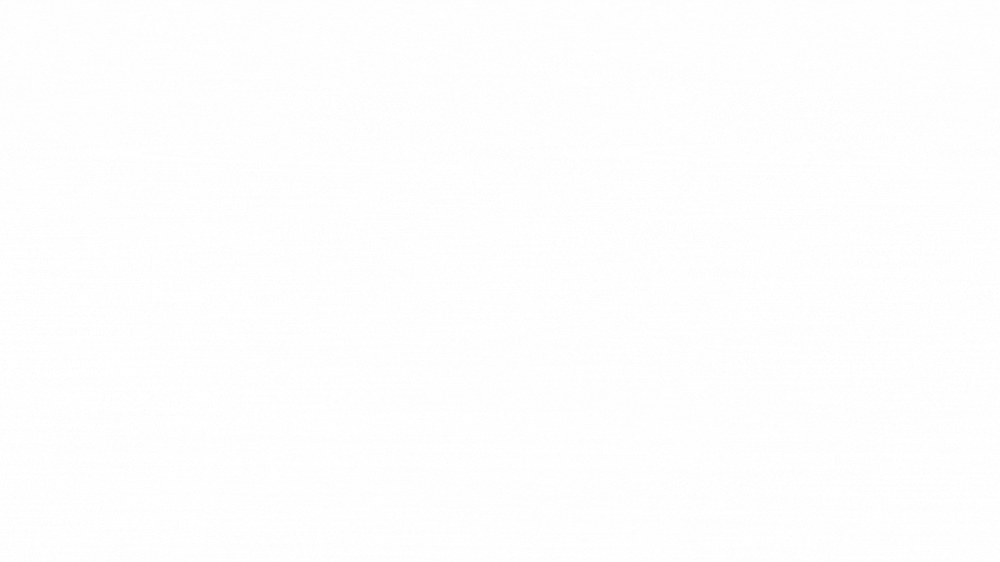

  
# Hi, There. It's Lucas here! 🙇🏻‍♂️

  
🧠 ***Gosto de pensar em não ter o que os intergalácticos chamariam de uma mente muito planetária*** - *Rick Sanchez* 

🧠 ***I like to think that i don't have what the intergalactics would call a very planet-bound mind*** - *Rick Sanchez*

🧑🏻‍💼 Atualmente, ainda trabalho fora do mercado de TI pois estou apenas estudando;

🧑🏻‍💼 Currently working as administrative because i am still learning I.T;

🌱 Estou no processo de aprendizagem para me tornar desenvolvedor FullStack;

🌱 I'm in the process of becoming a FullStack developer;

🪴 Me encontro no estágio Front-end do processo (me divertindo muito 🤭).

🪴 I'm currently in the Front-end stage (having lots of fun discovering my identity on this journey 🤭).
##

  
  

  
  

  

  
  

   

